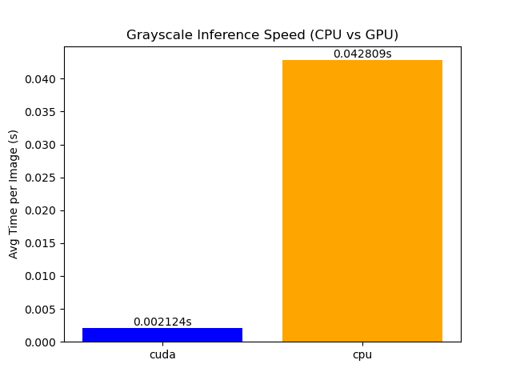
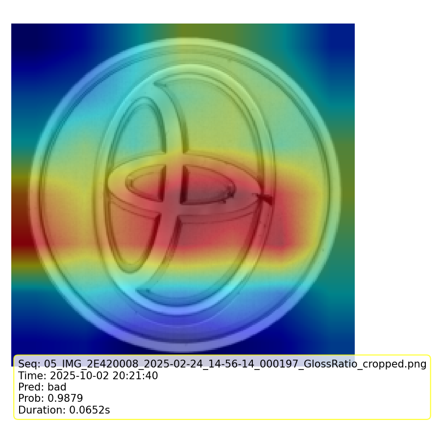

First, I need to check the dataset by myself.

It’s like a toyota logo, the background is all black.
According to the document, there are 1000 pictures of good and 350 pictures of bad. it's unbalance.

I think when there are many black, corrupted part or scratched part, it will be labeled as the bad class.

There is no need for data cleaning

PNG size 1024*1024

I try to do data augumentation since the product is a cirle-shaped item.
Also, because there is no significant influence for the RGB image, for process speed, it's better using the gray scale image.

for data augumentation, I am consider to rotate the image.

First, for the RGB image and gray scale image, I am consider to do the experiment.

validation/test set will not be augumented.
explainable AI, Grad-CAM / saliency

initialize anaconda

# RGB and grayscale image experiment with data augumentation
baseline A: ResNet50, RGB, rotation
baseline B: ResNet50, grayscale, roration

resize to 224 * 224

the result shows that 
the RGB image will be influence by the background sometime(red part)

at the same time, the gray scale image concentrates on the "bad" part

Also there is no significant difference in confusion_matrix and ROC

So based on this experiment, I choose to use grayscale image as input.

because the current model resnet50 is enough SOTA. I think I need to test the speed on GPU and CPU.

# experiment on the prediction speed of GPU and CPU
### Hardware Info
CPU: Intel64 Family 6 Model 165 Stepping 2, GenuineIntel

CPU Cores (logical): 12

CPU Frequency: 2592.00 MHz
RAM: 15.84 GB

GPU 0: NVIDIA GeForce RTX 2070 with Max-Q Design
  - Total Memory: 8.00 GB
  - CUDA Capability: 7.5

### Inference Speed
CUDA avg inference time: 0.002124 s/image

CPU avg inference time: 0.042809 s/image

so the Inference Speed is fast enough

# visualize log

I need to add a visualize log when it's the real factory environment.

according to my experience, the real factory will use GPU or Edge AI.

# to try more lite model

for resnet50, it need 360MB or more, so we need to try more lite model when we consider edge AI.

after the experiment, I decide to use MobileNetV3-Large model.